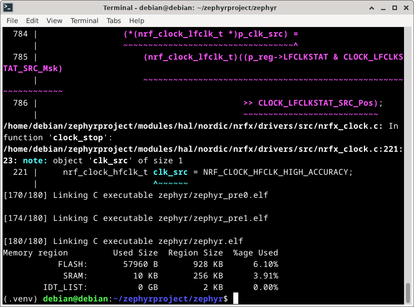

# measurement

The repository contains a software and data used in research on "Rapid design and validation of IoT measurement techniques using integrated emulation with RENODE". Experiments were carried out on Debian 12.9 using Renode framework, Zephyr OS, Linux based on Buildroot, a simple HTTP server and Robot Framework. In order to reproduce and modify the experiments, a virtual machine with Debian 12.9 installed on a partition of at least 40 GB and 4 GB RAM is recommended. The documentation presents individual steps to reproduce the results, the result of each step is presented in the form of a screenshot from the Linux system.

The repository has the following structure:
- renode - a directory contains a source code of BMP280 sensor for Renode,
- external - a directory with a software used to build Linux based on Buildroot with application using BMP280,
- zephyr - a directory contains two applications working in Zephyr OS:
    - simple - a simple application showing a communication of simulated board with the temperature sensor,
    - case1 - an application for aggregating data from a temperature sensor,
- server - a simple server that emulates a website api.weatherapi.com for testing purposes,
- bmp280zephyr.resc - Renode's script running Arduino Nano 33 BLE with BMP280 sensor in Renode,
- bmp280zephyr.robot - a Robot Framework script testing Arduino Nano 33 BLE with BMP280 sensor in Renode,
- measurement.resc - Renode's script running Zynq with BMP280 sensor in Renode,
- measurement.robot - a Robot Framework script testing Zynq with BMP280 sensor in Renode.

# Installing Renode
First install required packages in Debian 12.9.

```
sudo apt install git cmake mono-complete policykit-1 libgtk2.0-0 screen uml-utilities gtk-sharp2 libc6-dev libicu-dev gcc python3 python3-pip rsync libncurses-dev -y
```


Next download and compile source code of Renode framework By default all software is installed in a home directory. Remember to change paths if you want to install the software elsewhere.

```
cd ~
git clone https://github.com/renode/renode.git
cd renode
git checkout 8e8f9c62
./build.sh
```


In the end add BMP280 sensor into Renode, copying BMP280.cs to ~/renode/src/Infrastructure/src/Emulator/Peripherals/Peripherals/Sensors/ and modify ~/renode/src/Infrastructure/src/Emulator/Peripherals/Peripherals.csproj by adding \<Compile Include="Peripherals\Sensors\BMP280.cs" /> after \<Compile Include="Peripherals\Sensors\BMP180.cs" />.


Build the project one more time to compile BMP280 into Renode.

```
cd ~/renode
./build.sh
```


Run Renode to check if it works.

```
cd ~/renode
./renode
```


# Installing Zephyr

Install required packages and repositories to use Zephyr to run Case1.


```
sudo apt install --no-install-recommends git cmake ninja-build gperf \
  ccache dfu-util device-tree-compiler wget \
  python3-dev python3-pip python3-setuptools python3-tk python3-wheel xz-utils file \
  make gcc gcc-multilib g++-multilib libsdl2-dev libmagic1 python3-venv -y
python3 -m venv ~/zephyrproject/.venv
source ~/zephyrproject/.venv/bin/activate
pip install west
west init ~/zephyrproject
cd ~/zephyrproject
west update
west zephyr-export
west packages pip --install
cd ~/zephyrproject/zephyr
west sdk install
```


Then change a Zephyr's version to ensure compatibility with Case1 project.

```
cd ~/zephyrproject/zephyr
git checkout df9c0d8efa2
west update
```


Copy zephyr directory from repository to ~/zephyrproject/zephyr/.
Compile the simple program to check if everything was installed properly.

```
west build -p always -b arduino_nano_33_ble zephyr/simple
```


Copy bmp280zephyr.resc from measurement repository to ~/renode/scripts/single-node/. To run simple measruement software run Renode and run emulation of the board.

```
cd ~/renode
./renode
```

To run emulation write below text in Renode's console.

```
s @scripts/single-node/bmp280zephyr.resc 
```


Use command **quit** in Renode's console to exit from the simulation.

# Running Case1

Install Python3 packges.

```
cd ~/renode
source ~/zephyrproject/.venv/bin/activate
pip install -r /home/debian/renode/tests/requirements.txt
```

[Report of tests](images/req.png "Report of tests")

Copy bmp280zephyr.robot to ~/renode/tests/peripherals/.
Run tests for Case1.

```
cd ~/renode
source ~/zephyrproject/.venv/bin/activate
./renode-test tests/peripherals/bmp280zephyr.robot 
```

[Report of tests](images/test1.png "Report of tests")

The report can be found in ~/renode/output/tests/report.html.


# Buildroot

Copy external to ~/.

Next download Buildroot and build system using external config.

```
cd ~
git clone git://git.buildroot.net/buildroot
cd buildroot/
git checkout 87706103a6
make BR2_EXTERNAL=../external/
make measurement_defconfig
make BR2_ROOTFS_OVERLAY=../external/overlay/
make -j$(nproc)
```


Copy measurement.resc to ~/renode/scripts/single-node/. Copy measurement.robot to ~/renode/tests/platforms/.
Run simulation.

```
cd ~/renode
./renode
```

Start s @scripts/single-node/measurement.resc write user password when Renode will ask.
Then close Renode and configure a network devices to communicate with the simulated machine over the network.

```
sudo ip addr flash dev enp0s3
sudo ip link add name br0 type bridge
sudo ip link set enp0s3 master br0
sudo ip link set tap0 master br0
sudo ip link set up dev eno1
sudo ip link set up dev tap0
sudo ip link set up dev br0
sudo dhclient -v br0
sudo setcap 'cap_net_bind_service=+ep' /bin/python3.11
```

# Running Case2

Copy server directory to ~/.
Run tests for Case2.

```
source ~/zephyrproject/.venv/bin/activate
cd ~/renode
./renode-test tests/platforms/measurement.robot 
```


The report can be found in ~/renode/output/tests/report.html.


# References

https://github.com/renode/renode

https://renode.readthedocs.io/en/latest/

https://docs.zephyrproject.org/latest/develop/getting_started/index.html

